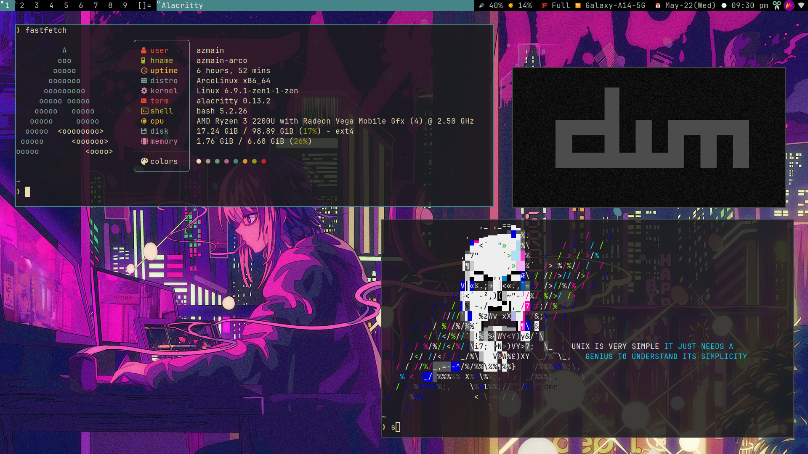
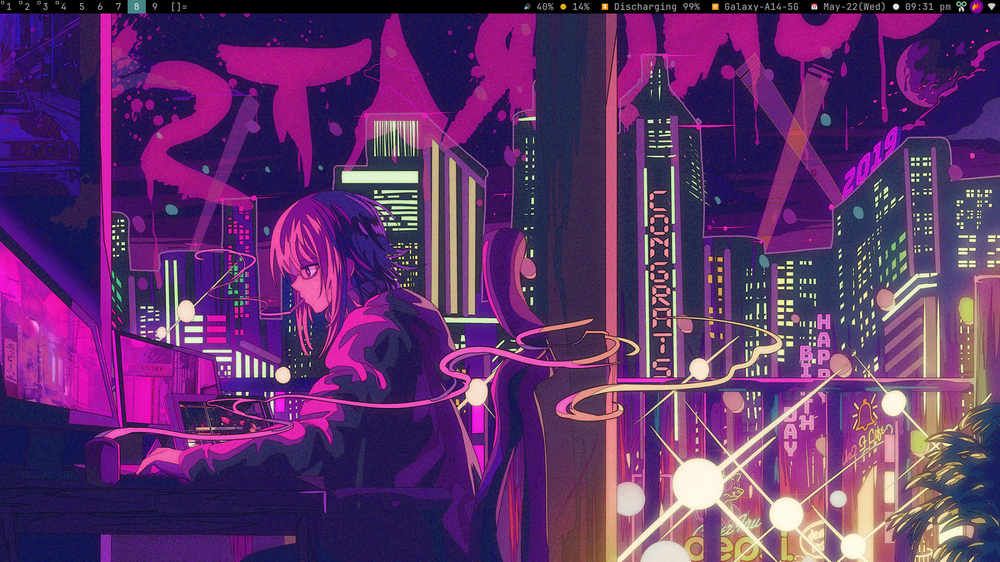

# my-dotfiles
I am using dwm in ArcoLinux.
- Wm: [dwm](https://github.com/AzmainBiswas/dwm), i3
- Lancher: [dmenu](https://github.com/AzmainBiswas/dmenu)
- StatusBar: [dwmblocks](https://github.com/AzmainBiswas/dwmblocks)
- Terminal: Alacritty, Kitty
- FetchTool: [fastfetch](https://github.com/fastfetch-cli/fastfetch)
- Filemannager: pcmanfm
- Image: sxiv

**NOTE:** For fd package in debian do
```shell
sudo apt install fd-find
ln -s $(which fdfind) ~/.local/bin/fd
```
Make sure that `$HOME/.local/bin` is in your `$PATH`.

## Previews





